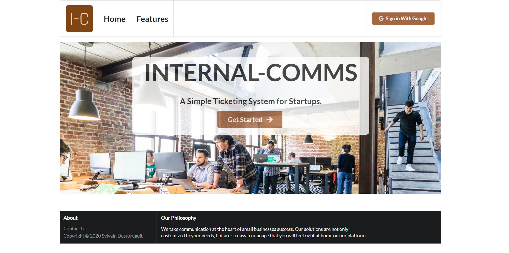

# Internal-Comms

A light, simple and dynamic ticketing system that will help small businesses keep track of what is important.

[Live Demo](https://internalcomms.netlify.app)

_For more examples and usage, please refer to the [Wiki](https://github.com/syldess/internal-comms-demo/wiki)._ (**coming soon**)

## Purpose

Internal-Comms was initially designed to be a MERN stack application to be used by small businesses.

This Front End demo was built to present the product to potential clients.

## Meta

Copyright (c) 2020 Sylvain Dessureault.

Distributed under the MIT license. See `LICENSE` for more information.

Using Semantic UI and Semantic UI-React, distributed under the MIT license, copyright (c) by [Semantic Org](https://github.com/Semantic-Org).

## Contributing

Interested in contributing to Internal-Comms? Please start by reading `CONTRIBUTING`.

1. Fork the internal-comms repo.
2. Create your feature branch (`git checkout -b feature/fooBar`).
3. Commit your changes (`git commit -m 'Add some fooBar'`).
4. Push to the branch (`git push origin feature/fooBar`).
5. Create a new Pull Request using our template.
